# C64 U83R Effects Megademo

A Commodore 64 / 6510 effects program built with ACME. It has a shared raster IRQ, a small three-voice SID routine, a generated text charset, and sixteen sequenced effects including two VIC bank-2 bitmap finales.

## Effects

1. TunnelVoyager
2. Perspective Corridor
3. Vector Starburst
4. Warp Grid
5. Gate Runner
6. Quantum Stars
7. Quantum Plasma
8. Neon Lightning
9. Hyper Warp Field
10. Fire/Ice Moiré
11. Raster Temple
12. Ocean Depth
13. Mirror Rune Tunnel
14. Sine City Scanner
15. Hires Bitmap Plasma
16. Bitmap/Text Bank Switch

Press `Space` to skip to the next effect. Each part also advances automatically.

## Build and run

Requirements: [ACME](https://sourceforge.net/projects/acme-crossass/) and Python 3. VICE (`x64sc`) is optional for running the generated PRG.

```sh
make build
make run
```

`make build` validates the source contract, assembles with strict segment checks, and verifies the C64 BASIC loader. The output is `build/c64_u83r_effects_megademo.prg`.

```sh
x64sc build/c64_u83r_effects_megademo.prg
```

## Reproducible effect captures

The repository includes a VICE framebuffer capture helper. It builds each
effect as an isolated preview, then reads the running emulator's indexed
framebuffer and palette through VICE's local binary monitor. This avoids using
illustrations in place of actual demo output.

```sh
python3 scripts/capture_previews.py
```

The command requires VICE `x64sc` (3.6 or later) and writes one PNG per effect
to `docs/effects/`. It starts every preview through the real `SYS 16384` BASIC
path and verifies the installed IRQ vector, running effect loop, CPU mapping,
CIA2 bank pins, and relevant VIC mode/pointer bits before writing a capture.
Use `make capture` or capture a single zero-based effect index instead:

```sh
python3 scripts/capture_previews.py --effect 0
```

## Verified effect gallery

| 1. TunnelVoyager | 2. Perspective Corridor | 3. Vector Starburst | 4. Warp Grid |
| --- | --- | --- | --- |
| 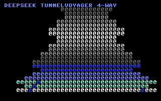 | 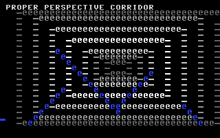 | 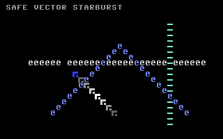 | 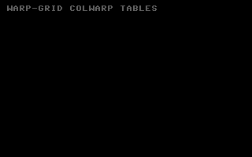 |
| 5. Gate Runner | 6. Quantum Stars | 7. Quantum Plasma | 8. Neon Lightning |
| 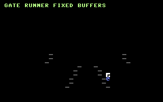 | 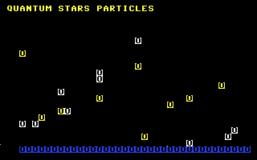 | 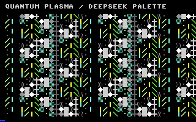 | 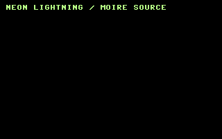 |
| 9. Hyper Warp Field | 10. Fire/Ice Moiré | 11. Raster Temple | 12. Ocean Depth |
| 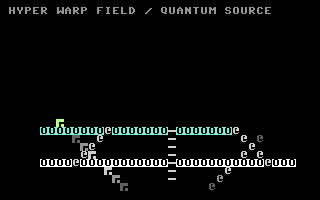 | 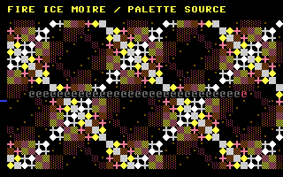 | 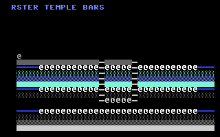 | 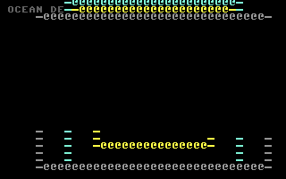 |
| 13. Mirror Rune Tunnel | 14. Sine City Scanner | 15. Hires Bitmap Plasma | 16. Bitmap/Text Bank Switch |
| 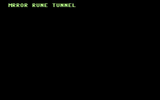 | 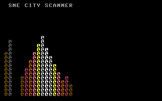 | 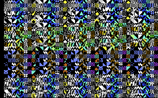 | 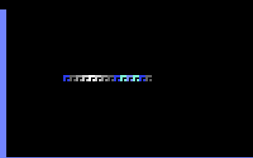 |

## Design and safety

- The executable loads at `$0801` and starts at `$4000` through `SYS 16384`.
- Text effects use VIC bank 0, screen `$0400`, and generated charset `$2000`.
- The final two effects use VIC bank 2, screen `$8400`, and hires bitmap `$A000`.
- The final bank-switch effect intentionally alternates text bank 0 and bitmap bank 2; the IRQ follows its live phase instead of overwriting it.
- A source guard keeps code and data below `$8000`, leaving the bitmap bank available.
- The IRQ and part-transition routines explicitly restore VIC state before text or bitmap rendering.

See [the memory map](docs/MEMORY_MAP.md) and [audit record](docs/AUDIT.md) for the details.

## Repository cleanup

The supplied archive contained 33 byte-identical FIX70–FIX95 source copies and multiple duplicate wrappers. This repository intentionally keeps one production source, one build path, and two focused checks. The discarded copies did not contain any distinct implementation.

An existing private project, `c64-u83r-rul3z-new-effects`, is a separate four-effect text-mode demo with unrelated source and assets; this 16-effect megademo is therefore published independently.

No software license was supplied with the input archive, so this repository does not assert a new redistribution license.
